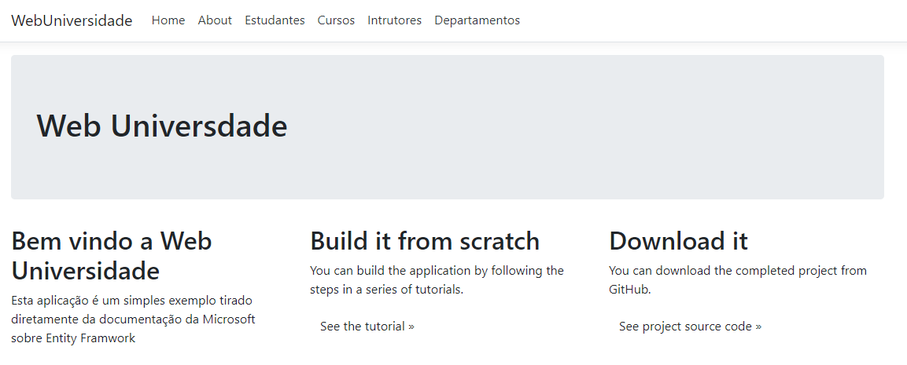
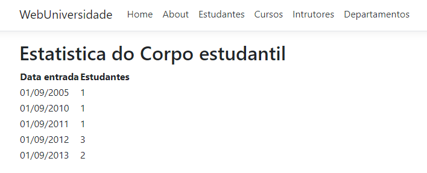
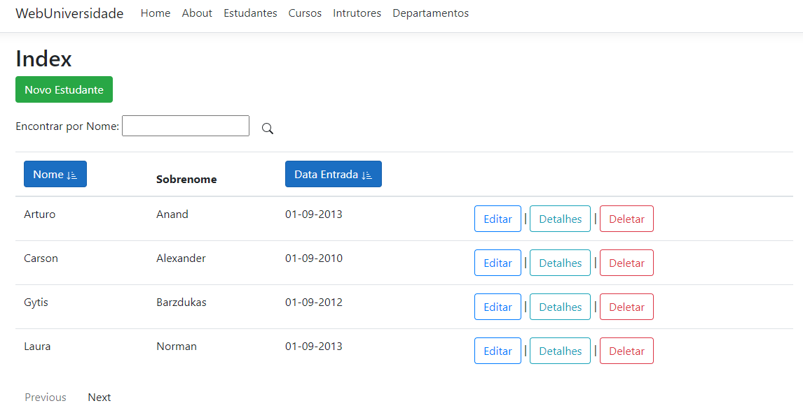
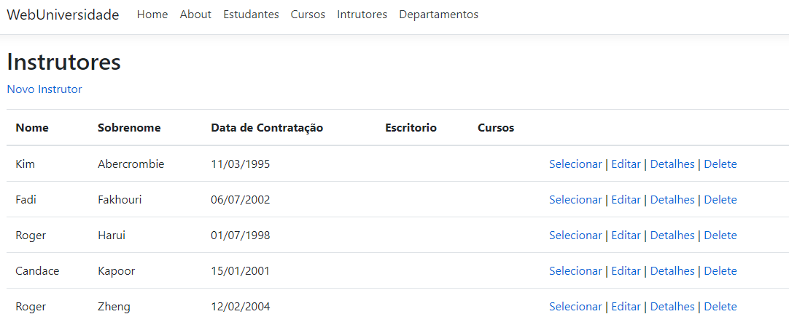
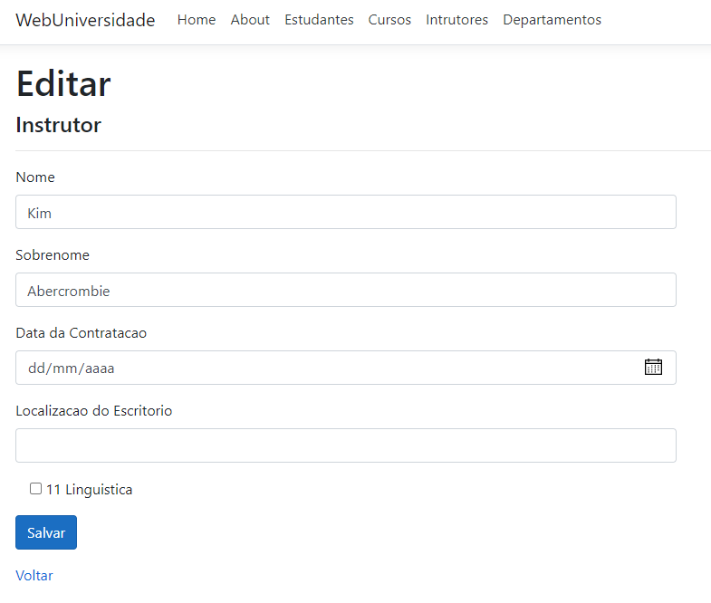

# web-universidade
Aplicativo utilizando algumas tecnologias que compõem o Asp. Net

## Sistema para Cadastro e Gerenciamento de uma universidade 

Web App com HTML, CSS, JAVASCRIPT, Bootstrap, Asp.Net Core,  salvando os dados no banco de dados SQLServer seguindo o padrao do MVC e utilizando o Entity Framework.

#### Diagrama

#### HomePage

#### Estatistica

#### Estudante - index

#### Instrutores - index

#### Instrutores - Editar

### Autor

* **Silvio Antonio** *Graduado em Sistemas para Internet*

* [Github](https://github.com/silvioantonio)
* [Linkedin](https://www.linkedin.com/in/silvio-antonio-de-oliveira-junior-621813142/)
* [Email](mailto:oliveira_0000@hotmail.com)

### licença

Este projeto está licenciado sob a licença MIT - consulte o arquivo [LICENSE.md](LICENSE) para obter detalhes

### Tecnologias utilizadas

* HTML
* CSS
* JAVASCRIPT
* BOOTSTRAP
* ASP.NET CORE
* SQL SERVER
* ENTITY FRAMEWORK
